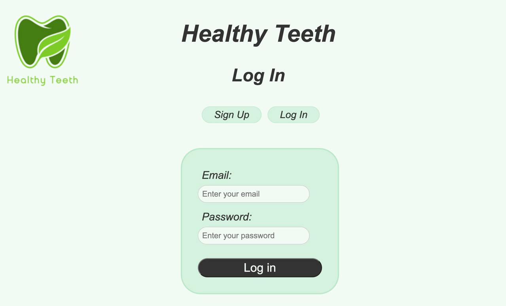
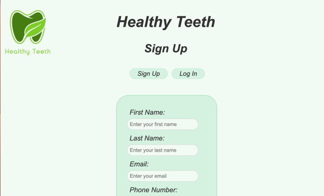
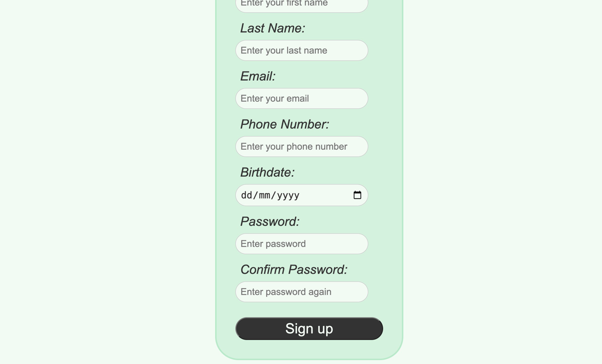
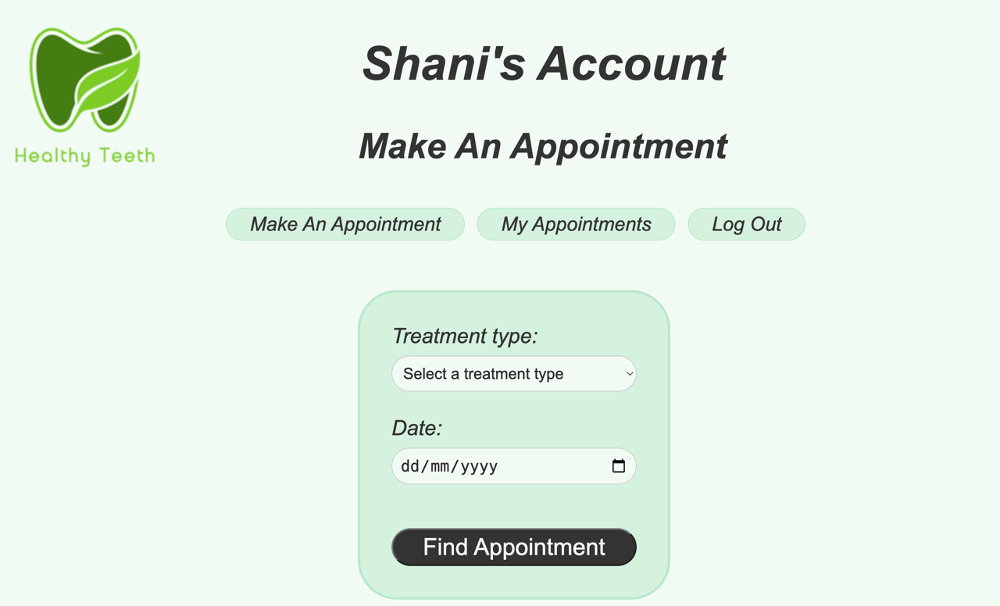
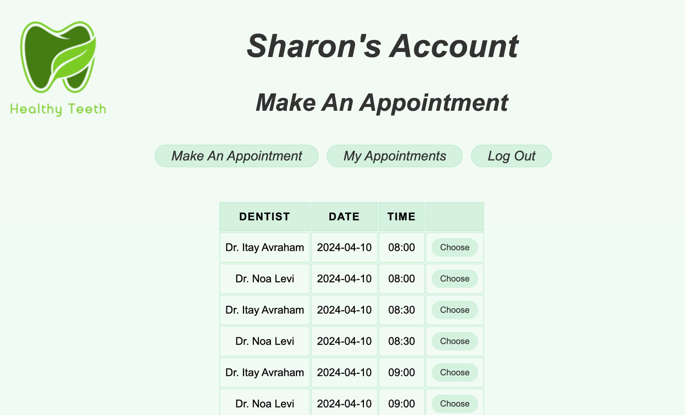
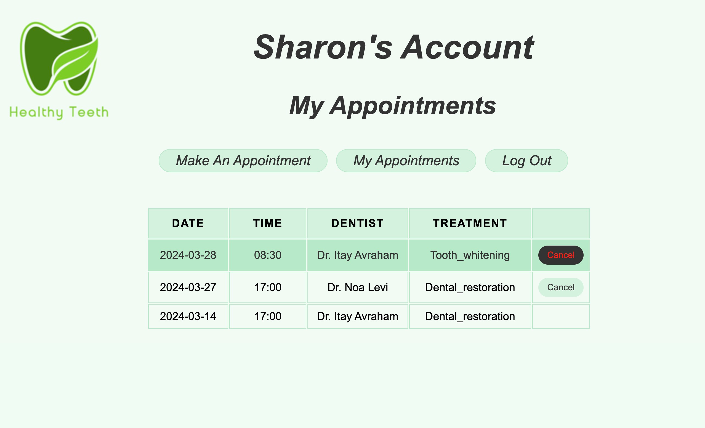
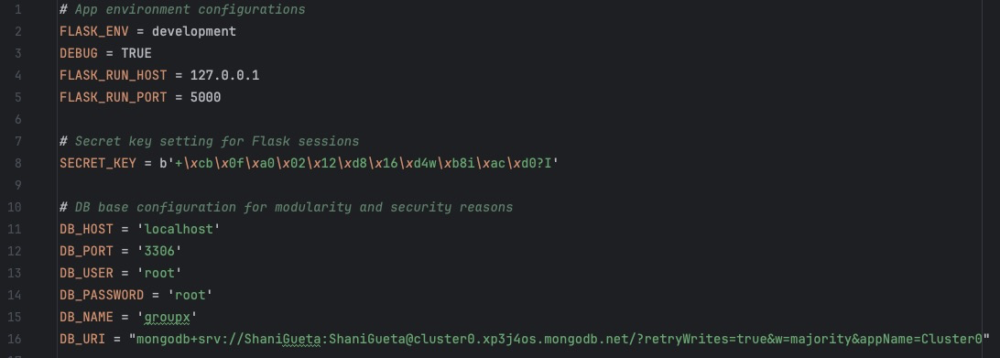

# Web Project Part C Group 10 - Healthy Teeth

###  הסבר קצר של הרעיון:
״ האתר שלנו עוסק בקביעת תורים למרפאת שיניים פרטית הנקראת Healthy Teeth ״
 
המטרה המרכזית הינה הצגת פרטי תורים פנויים להרשמה, אפשרות הרשמה לתור חדש, צפייה בהיסטורית התורים שנקבעו ואפשרות ביטול תורים עתידיים שנקבעו על ידי המשתמש.
 
על המשתמש להירשם ולהתחבר למערכת על מנת לבצע את הפעולות הנ״ל.
 

### סדר פעולות באתר:
1. במידה ואין למשתמש יוזר קיים במערכת, על המשתמש להירשם למערכת בעמוד sign up
2. על המשתמש להתחבר למערכת בעמוד sign in
3. לאחר התחברות מוצלחת לאתר, המשתמש יועבר אוטומטית לעמוד הרשמה לתור חדש, ויחשף בפניו גם תפריט פעולות הכולל - הרשמה לתור חדש, צפייה בהיסטורית התורים שלו, התנתקות מהמערכת
 
3.1 בחירה בהרשמה לתור חדש:
 
המשתמש יזין את סוג הטיפול הרצוי ותאריך שבו מעוניין לקבוע את התור וילחץ על הכפתור לחיפוש
 
3.1.1 המשתמש יבחר מתוך טבלה נגללת של תורים פנויים להרשמה את העובד והשעה שהוא מעדיף לקביעת התור.
 
לאחר בחירת התור הרצוי המשתמש יועבר אוטומטית למסך היסטורית התורים שלו. 
 
3.2 בחירה בהיסטורית התורים:
 
בבחירת אופציה זאת בתפריט, מוצגת למשתמש טבלה המכילה פרטים אודות כל היסטורית התורים שקבע. עבור כל תור יצויין - תאריך התור, שעת התור, מי הרופא או השיננית שמבצע את הטיפול, סוג הטיפול, לתורים עתידיים קיים גם כפתור לביטול התור.
בלחיצה על ביטול תור התור יבוטל והטבלה תתעדכן באופן מיידי.
 
3.3 בחירה בהתנתקות מהמערכת:
 
בבחירת אפשרות זאת, המשתמש ינותק מהמערכת ויעבור למסך ההתחברות שם יוצג לו תפריט מצומצם שכולל רק הרשמה למערכת או התחברות למערכת.

### העמודים באתר:
#### Log In
בהזמנת אימייל וסיסמה איתם נרשם לאתר, המשתמש יוכל להתחבר למערכת.
לאחר ההתחברות, המשתמש יועבר למסך קביעת תור חדש.
 
#### Sign up
מסך ההרשמה למערכת, על המשתמש להזין את הפרטים בשדות הטופס על מנת ליצור משתמש במערכת. כל השדות הוגדרו כחובה.
 
 
#### Make An Appointment
בהזנת סוג הטיפול הרצוי ותאריך תוצג למשתמש טבלה המכילה תורים פנויים להרשמה וכפתור בחירה ליד כל תור המאפשר לו לקבוע את התור הרצוי בקלות.
 
 
#### My Appointments
מוצגת למשתמש טבלה המכילה את היסטורית התורים שקבע עם אפשרות לביטול עבור תורים עתידיים בלחיצה פשוטה על כפתור הביטול.
כשעומדים על כפתור הביטול הוא משנה צבעים על מנת להסוות את תשומת ליבו של המשתמש לפעולה שהוא עומד לבצע במידה וילחץ.
 
 

### מבנה תיקיות הפרויקט:
בפרויקט השתמשנו בשלד שהועלה למודל לחלק ג - Flask skeleton project
 
#### components:
בתיקייה זו נמצאות 2 תיקיות - header, main_menu
 
בתוך כל תיקייה יש קובץ פייתון ו2 תיקיות נוספות - static, templates
 
#### pages:
תיקייה זו מכילה את כל העמודים של האתר וקובץ פייתון [pages.py](pages%2Fpages.py) - 
 [logIn](pages%2FlogIn)
 [makeAnAppointment](pages%2FmakeAnAppointment)
 [myAppointments](pages%2FmyAppointments)
 [registration](pages%2Fregistration)
  בתוך כל תיקייה של עמוד באתר יש קובץ פיתון ו2 תיקיות - static, templates 
#### static:
בתיקיות אלו מאוכלסים קבצי CSS,JavaScript
 
כל סוג קובץ בתיקיה נפרדת.
#### templates:
בתיקייה זו מאוכלסים קבצי html שהומרו לטמפלייטים
#### utilities:
תיקייה זו מכילה קובץ פייתון
 [db_manager.py](utilities%2Fdb%2Fdb_manager.py)
 
המכיל הגדרות הקשורות לבסיס הנתונים וקיבלנו אותה כחלק משלד הפרויקט של חלק ג.
#### other files:
תיקייה הפריקט מכילה גם קבצים נוספים כמו קובץ
 [app.py](app.py) 
 
.המריץ את השרת
 וקובץ קישור לבסיס נתונים
 
[db_connector.py](db_connector.py)
 
-וקבצים נוספים
 [README.md](README.md)
 [requirements.txt](requirements.txt)
 [settings.py](settings.py)
 [.env](.env)

### טיפול בבקשות לקוח:
- הרשמה למערכת
- התחברות למערכת
- חיפוש תורים פנויים להרשמה לפי פרמטרים
- קביעת תור חדש
- הצגת היסטוריית התורים
- ביטול תור
- התנתקות מהמערכת

### חיבור לבסיס נתונים, שאילתות sql ומימוש טפסים:
#### הרשמה לאתר:
לאחר הזנת הפרטים בשדות המתאימים ולחיצה על שליחת הטופס לבקשת הרשמה למערכת, מתבצעת בדיקת וולידציה על השדות לצורך ויידוא תקינותם.
 
במידה והפרטים לא תקינים, יקבל הודעות בהתאם ולא יוכל לשלוח את הטופס עד שיתקנם.
 
במידה והפרטים שהזין תקינים, מתבצעת בדיקה מול בסיס הנתונים אם המשתמש כבר קיים במערכת.
 
במידה והמשתמש קיים, תוצג למשתמש הודעה בהתאם והוא ישאר במסך ההרשמה ויוכל למלא אותו בפרטים אחרים או לעבור לעמוד ההתחברות בתפריט ולהיכנס למשתמש הקיים במערכת.
 
אם כל הפרטים שהזין בשדות עברו את הוולידציה ואת הבדיקה מול בסיס הנתונים, אז תרוץ שאילתה ליצירת לקוח חדש בבסיס הנתונים.
 
לאחר מכן יעבור למסך ההתחברות ויקבל הודעת אימות על הצלחת הרישום למערכת.

#### התחברות לאתר:
לאחר הזנת כל הפרטים בשדות המתאימים ולחיצה על שליחת הטופס לבקשת הרשמה למערכת, מתבצעת בדיקת וולידציה על השדות לצורך ויידוא תקינותם.
 
במידה והפרטים לא תקינים לא יוכל לשלוח את הטופס ולהתחבר עד שיתקנם.
 
במידה והפרטים שהזין תקינים, מתבצעת בדיקה מול בסיס הנתונים אם המשתמש קיים במערכת.
 
במידה והמשתמש קיים הוא יתחבר למערכת ויועבר לדף קביעת תור חדש.
 
במידה והמשתמש לא קיים במערכת תתבצע בדיקה של אימייל בלבד מול בסיס הנתונים- אם קיים תוצג למשתמש הודעה על סיסמה שגויה. אם לא קיים, תוצג למשתמש הודעה על אימייל שגוי.

#### חיפוש תורים פנויים להרשמה:
המשתמש בוחר מתוך רשימת גלילה את סוג הטיפול הרצוי, ותאריך (מאותו יום והלאה) ושולח את הטופס על ידי לחיצה על כפתור החיפוש.
 
בשליחת הטופס מתבצעת בדיקה מול בסיס הנתונים.
 
בבדיקה רצות שאילתות שמייצרות ללקוח רשימה של כל התורים הפנויים להרשמה בתאריך הנבחר, לפי שעות העבודה של המרפאה, ולפי סוג העובד הדרוש המותאם לטיפול.
 
רשימת התורים מוצגת בתוך טבלה שלכל תור יש לחצן בחירה בתור.

#### הרשמה לתור חדש:
בלחיצה על כפתור הבחירה בתור, מתבצעת בדיקה מול בסיס הנתונים האם ללקוח יש תור באותו תאריך ושעה שהוא מנסה לקבוע לתור החדש.
 
במידה ואין תור חופף בתאריך ובשעה שניסה לקבוע, התור יקבע ללקוח ופרטי התור יוכנסו לבסיס הנתונים.
 
במידה והלקוח מנסה לקבוע תור שני לאותו תאריך ואותה שעה, הוא יועבר אוטומטית לדף היסטורית התורים שלו שם תוצג לו הודעה שמסבירה כי יש לו תור בזמנים האלו ומתחת להודעה יוצג אותו תור.
 
המשתמש יכול לבטל את התור במידה וירצה לקבוע בכל זאת את התור החדש

#### הצגת היסטורית התורים:
לצורך הצגת היסטורית התורים, תתבצע בבסיס הנתונים שאילתה להוצאת כל התורים שאותו לקוח קבע ותוצאותיה יוצגו בטבלה

#### ביטול תור:
לאחר בחירה בביטול תור, תתבצע שאילתה למחיקת התור בבסיס הנתונים לפי הפרמטרים של התור הנבחר

### הקמת בסיס הנתונים:
1. Update your .env file (attached in Moodle):
 

2. Upload the db_connector.py file to your project folder:
 [db_connector.py](db_connector.py)
 בקובץ זה הגדרנו קלאסטר, בסיס נתונים, קולקשיינים, ופונקציות הקשורות לבסיס הנתונים.

### html to templates:
כל עמודי ה html
 
תורגמו ל template
 
והוכנסו לתיקיות בהתאם.
